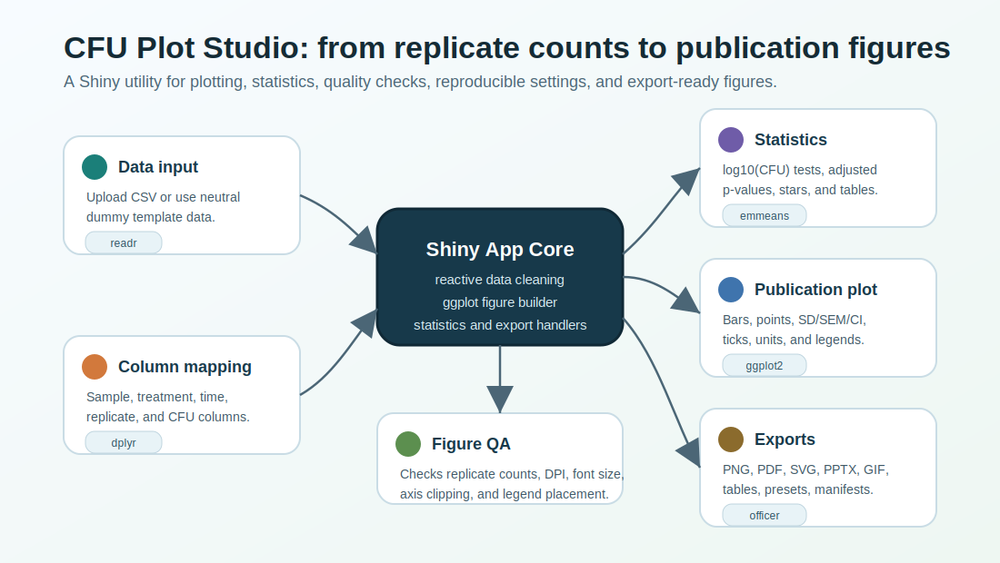

# CFU Plot Studio


**CFU Plot Studio** is an R Shiny app for publication-ready colony forming unit figures, replicate-level statistics, quality control checks, and reproducible figure export.

It was built for lab workflows where CFU counts are measured across strains, vectors, plasmids, treatments, timepoints, and replicate plates. The goal is simple: upload replicate-level data, make a clean figure, run transparent statistics, export the graph, and keep enough metadata to reproduce the result later.

Repository: [mbaffour/cfu-plot-studio](https://github.com/mbaffour/cfu-plot-studio)  
Release: [v0.1.0](https://github.com/mbaffour/cfu-plot-studio/releases/tag/v0.1.0)  
Bug reports: [open a GitHub issue](https://github.com/mbaffour/cfu-plot-studio/issues/new?template=bug_report.md)

## What the app does


- Imports replicate-level CSV files.
- Includes neutral synthetic dummy data as a safe template.
- Maps sample, vector, treatment, timepoint, replicate, and CFU columns inside the app.
- Makes publication-focused CFU bar plots.
- Shows replicate points and SD, SEM, 95% CI, IQR, or min-max variation.
- Runs statistics on replicate-level `log10(CFU)`.
- Shows significance as stars, adjusted p/q values, or no labels.
- Supports single-timepoint plots, selected-sample plots, and combined multi-timepoint plots.
- Customizes axis limits, major ticks, minor ticks, tick marks, plot boxes, labels, units, legend placement, colors, and exact figure size.
- Exports PNG, PDF, SVG, PowerPoint, animated GIF, reveal-slide PowerPoint, tables, plot presets, manifests, and reproducible R scripts.

## Component map



The app connects data import, column mapping, quality checks, statistics, plot styling, and export in one workflow.

## Quick start

Install the core packages in R:

```r
install.packages(c(
  "shiny",
  "ggplot2",
  "dplyr",
  "readr",
  "emmeans",
  "broom",
  "DT",
  "colourpicker",
  "jsonlite"
))
```

Optional packages for PowerPoint and GIF export:

```r
install.packages(c("officer", "rvg", "gganimate", "gifski"))
```

Run from the project folder:

```r
shiny::runApp(".")
```

or:

```powershell
Rscript run_app.R
```

## Input data

Your CSV should contain one row per replicate measurement.

| Field | Example values |
| --- | --- |
| Sample, strain, vector, plasmid, or group | `Control strain`, `Test strain`, `Empty vector`, `Plasmid vector` |
| Treatment, dose, condition, or concentration | `Baseline`, `Treatment A`, `Treatment B`, `0`, `10` |
| Timepoint | `Early`, `Late`, `0 h`, `24 h` |
| Replicate | `1`, `2`, `3` |
| CFU count | `4300000`, `2.1e6`, `95000` |

The repository includes `dummy_cfu_example.csv`, a synthetic dataset that can be used as a template.

## Statistics and publication controls

Statistics are run on `log10(CFU)` values. The app supports Welch t-tests, Student t-tests, and model-based comparisons with `emmeans`, with BH, Holm, Bonferroni, or no multiple-comparison correction.

Figure controls include exact width and height, DPI, y-axis boundaries, major and minor tick spacing, major and minor grid lines, y-axis tick marks, plot boxes, font sizes, bar width, point jitter, legend position, unit labels, and custom colors.

## Outputs

CFU Plot Studio can export:

- publication figures as PNG, PDF, SVG, PowerPoint, animated GIF, or reveal-slide PowerPoint
- cleaned data
- summary statistics
- QC tables
- Figure QA tables
- statistical results
- ANOVA tables
- plot preset JSON
- analysis manifest JSON
- reproducible R scripts

## Full post

The full launch article and user guide is in [BLOGPOST.md](https://github.com/mbaffour/cfu-plot-studio/blob/main/BLOGPOST.md).

## Bug reports and contact

Please report issues through GitHub:

- [Open a bug report](https://github.com/mbaffour/cfu-plot-studio/issues/new?template=bug_report.md)
- [Request a feature](https://github.com/mbaffour/cfu-plot-studio/issues/new?template=feature_request.md)
- [View all issues](https://github.com/mbaffour/cfu-plot-studio/issues)

Include your operating system, R version, browser, app version, what you clicked, the exact error message, and a small synthetic CSV if data are needed to reproduce the problem.

Please do not post private or unpublished experimental data in public issues.
