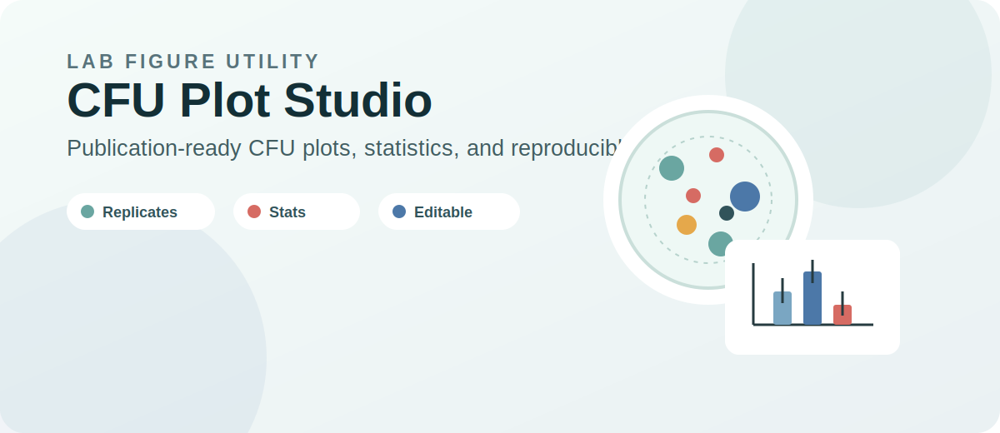
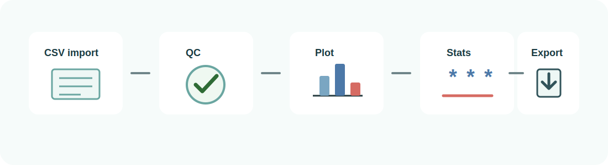

# CFU Plot Studio

**CFU Plot Studio** is an R Shiny app for publication-ready CFU figures, replicate-level statistics, figure QC, and reproducible figure exports.

Colony forming unit assays are beautifully direct at the bench: count colonies, calculate CFU, compare conditions. The figure-making side is often less beautiful. A single experiment can include several strains or vectors, multiple treatments, multiple timepoints, replicate plates, log-scaled counts, statistics, and journal-specific figure sizing.

CFU Plot Studio was built to make that workflow cleaner, more reproducible, and easier to share.

## What It Does

- Imports replicate-level CSV files.
- Maps sample, treatment, timepoint, replicate, and CFU columns.
- Makes publication-focused CFU bar plots.
- Shows SD, SEM, 95% CI, IQR, or min-max variation.
- Runs replicate-level statistics on `log10(CFU)`.
- Exports PNG, PDF, SVG, PowerPoint, GIF, summary tables, statistics, plot presets, manifests, and reproducible R scripts.

## Get The App

GitHub repository: [mbaffour/cfu-plot-studio](https://github.com/mbaffour/cfu-plot-studio)

Read the full project post in [BLOGPOST.md](../BLOGPOST.md), or start with the [README](../README.md).

## Bug Reports And Contact

Please report bugs through GitHub Issues:

- [Open a bug report](https://github.com/mbaffour/cfu-plot-studio/issues/new?template=bug_report.md)
- [Request a feature](https://github.com/mbaffour/cfu-plot-studio/issues/new?template=feature_request.md)
- [View all issues](https://github.com/mbaffour/cfu-plot-studio/issues)

Include your operating system, R version, what you clicked, and a small synthetic CSV if data are needed to reproduce the issue.

Do not post private or unpublished experimental data in public issues.
