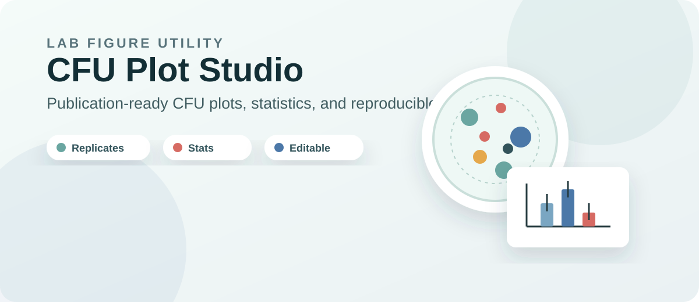
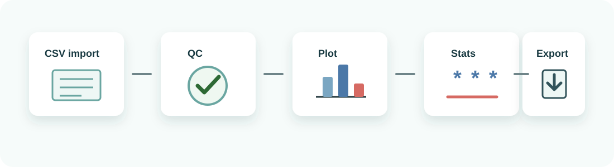
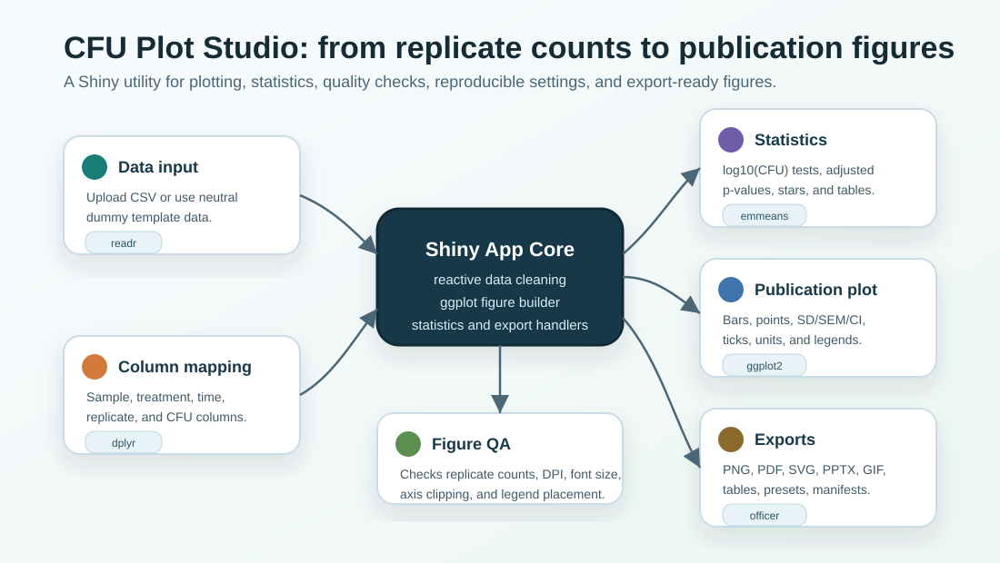

# CFU Plot Studio



**CFU Plot Studio** is an R Shiny app for publication-ready colony forming unit figures, replicate-level statistics, quality control checks, and reproducible figure export.

It was built for lab workflows where CFU counts are measured across strains, vectors, plasmids, treatments, timepoints, and replicate plates. The goal is simple: upload replicate-level data, make a clean figure, run transparent statistics, export the graph, and keep enough metadata to reproduce the result later.

Repository: [mbaffour/cfu-plot-studio](https://github.com/mbaffour/cfu-plot-studio)  
Release: [v0.1.0](https://github.com/mbaffour/cfu-plot-studio/releases/tag/v0.1.0)  
Bug reports: [open a GitHub issue](https://github.com/mbaffour/cfu-plot-studio/issues/new?template=bug_report.md)

## What the app does



- Imports replicate-level CSV files and maps the columns inside the app.
- Ships neutral synthetic data as a safe template.
- Plots absolute CFU as bars or points, with SD, SEM, 95% CI, IQR or min-max intervals and every replicate shown.
- **Paired survival readout** — CFU at the readout timepoint relative to baseline *within the same culture*, which is what an induction time-course is actually asking. Pairing does not change the estimate when every pair is complete; it changes the uncertainty, and it changes the answer when a replicate is missing one timepoint.
- Runs statistics on `log10(CFU)`: Welch, Student, Wilcoxon, or model-based marginal means, with BH, Holm or Bonferroni correction — reporting confidence intervals, fold-change intervals and effect sizes, not just p values.
- Optional pairing for between-construct and between-dose comparisons, off by default because the CSV cannot prove replicates match across groups.
- **Fixed panel geometry** — pin the data area so it stays identical however the legend and labels change, instead of being whatever space is left over.
- Preview drawn at the exact export geometry, so on-screen font sizes are the exported font sizes.
- Per-bar colouring, click-to-place legend and draggable statistic labels.
- Figure size in inches or millimetres, with journal-width presets.
- A Figure QA checklist, and QC that reports what was dropped and why — including replicates that lost their partner and cells that vanish from the figure entirely.
- Exports everything in one archive: PNG, PDF, SVG, PowerPoint, animated GIF, every table, a standalone rebuild script, the preset and the manifest.

## Component map



The app connects data import, column mapping, quality checks, statistics, plot styling, and export in one workflow.

## Get it and run it

CFU Plot Studio is an R Shiny app. It runs on **your** machine — nothing is uploaded, and
no data leaves your computer. There is no hosted version to click into, because the whole
point is that your unpublished counts stay local.

### 1. Install R

Windows and macOS builds: <https://cran.r-project.org/>. Nothing else is required —
the launcher installs the R packages for you, into a private folder beside the app.

### 2. Download the app

- **[Download the current version as a ZIP](https://github.com/mbaffour/cfu-plot-studio/archive/refs/heads/main.zip)**, then unzip it anywhere.
- Or clone it, if you would rather pull updates later:

  ```bash
  git clone https://github.com/mbaffour/cfu-plot-studio.git
  ```

### 3. Start it

**Windows** — double-click **`Run CFU Plot Studio.bat`**. It finds R, installs anything
missing into a private `.Rlibrary` folder beside the app, picks a free port, and opens
your browser. Close the console window to stop it. The first run installs packages and
takes a few minutes; later runs start in seconds.

If R is installed somewhere unusual, point the launcher at it:

```powershell
setx CFU_RSCRIPT "C:\Program Files\R\R-4.5.0\bin\Rscript.exe"
```

**macOS or Linux** — from the app folder:

```bash
Rscript run_app.R
```

`run_app.R` does the same dependency check and port selection, and works from any working
directory.

| Variable | Default | Purpose |
| --- | --- | --- |
| `CFU_RSCRIPT` | auto-detected | Which `Rscript.exe` the Windows launcher uses |
| `CFU_APP_HOST` | `127.0.0.1` | Bind address |
| `CFU_APP_PORT` | first free from 4267 | Fixed port |
| `CFU_APP_LIB` | `<app>/.Rlibrary` | Where missing packages are installed |
| `CFU_NO_INSTALL` | unset | Set to `1` to fail rather than install anything |

### 4. Try it before using your own data

Click **Load dummy example data** in the sidebar, or **Download dummy/template CSV** to
see the expected layout. The bundled dataset is synthetic, so you can learn the tool — or
file a reproducible bug report — without touching unpublished results.

### Installing packages by hand

The launchers do this for you. If you would rather:

```r
install.packages(c(
  "shiny", "ggplot2", "dplyr", "readr", "tibble", "tidyr", "scales",
  "emmeans", "broom", "DT", "colourpicker", "jsonlite", "zip"
))
```

Optional, each affecting only the export format named:

```r
install.packages(c(
  "officer",    # PowerPoint export
  "rvg",        # editable vector art inside PowerPoint
  "gganimate",  # animated GIF export
  "gifski"      # GIF encoding
))
```

The app reports at startup which of these are absent, and what each one costs you.

### Checking it works

```bash
Rscript tests/test_end_to_end.R          # optionally: ... path/to/your.csv
```

Point it at your own CSV to run the whole pipeline against your data. The other suites —
`test_bundle.R`, `test_panel_size.R`, `test_survival.R`, `test_statistics.R`,
`test_column_matching.R` — check the figure geometry, the paired survival readout, every
statistic, and CSV column detection.

## Input data

Your CSV should contain one row per replicate measurement.

| Field | Example values |
| --- | --- |
| Sample, strain, vector, plasmid, or group | `Control strain`, `Test strain`, `Empty vector`, `Plasmid vector` |
| Treatment, dose, condition, or concentration | `Baseline`, `Treatment A`, `Treatment B`, `0`, `10` |
| Timepoint | `Early`, `Late`, `0 h`, `24 h` |
| Replicate | `1`, `2`, `3` |
| CFU count | `4300000`, `2.1e6`, `95000` |

The repository includes `dummy_cfu_example.csv`, a synthetic dataset that can be used as a template.

## Statistics and publication controls

Statistics are run on `log10(CFU)` values. The app supports Welch t-tests, Student t-tests, and model-based comparisons with `emmeans`, with BH, Holm, Bonferroni, or no multiple-comparison correction.

Figure controls include exact width and height, DPI, y-axis boundaries, major and minor tick spacing, major and minor grid lines, y-axis tick marks, plot boxes, font sizes, bar width, point jitter, legend position, unit labels, and custom colors.

## Outputs

**Download everything (.zip)** collects all of it in one archive, with a README listing
the contents, the figure geometry, the readout, and anything that could not be produced:

- the figure as PNG, PDF, SVG and PowerPoint (animated GIF optional)
- the cleaned data, and the rows actually plotted
- the summary, statistics, ANOVA, QC and Figure QA tables
- a standalone R script that rebuilds the figure from embedded data
- the plot preset and the analysis manifest

Each item is produced independently, so a missing optional package costs that one file
rather than the whole archive.

## Full post

The full launch article and user guide is in [BLOGPOST.md](https://github.com/mbaffour/cfu-plot-studio/blob/main/BLOGPOST.md).

## Bug reports and contact

Please report issues through GitHub:

- [Open a bug report](https://github.com/mbaffour/cfu-plot-studio/issues/new?template=bug_report.md)
- [Request a feature](https://github.com/mbaffour/cfu-plot-studio/issues/new?template=feature_request.md)
- [View all issues](https://github.com/mbaffour/cfu-plot-studio/issues)

Include your operating system, R version, browser, app version, what you clicked, the exact error message, and a small synthetic CSV if data are needed to reproduce the problem.

Please do not post private or unpublished experimental data in public issues.
